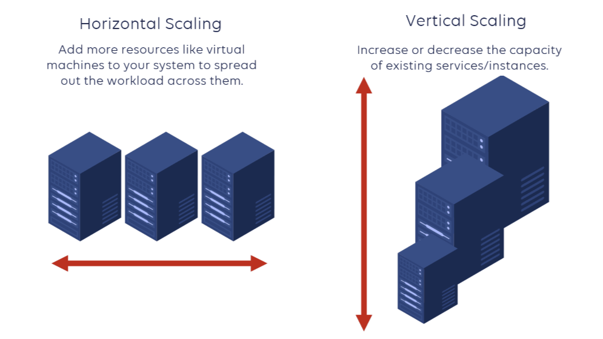

# Horizontal vs Vertical Scaling

- **Horizontal (→)**  
  Horizontal Scaling refers to adding additional nodes of the same setup.

- **Vertical (↑)**  
  Vertical Scaling describes adding more power (resources) to your current machines.
